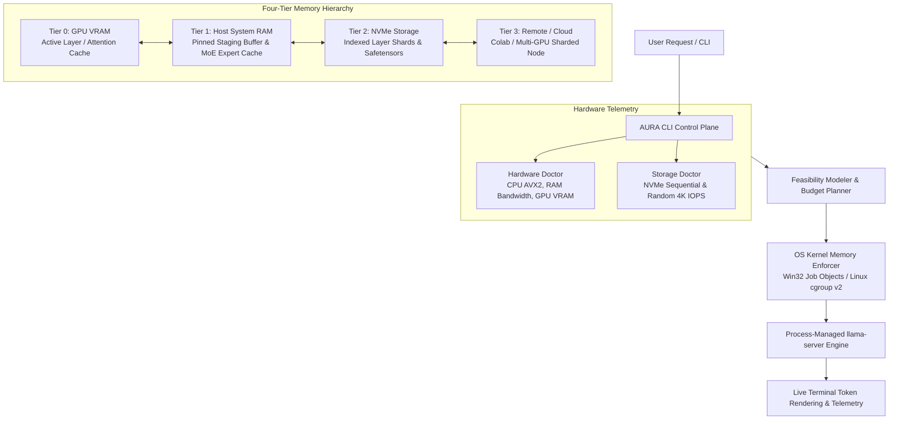

# AURA
### Adaptive Ultra-Low-Memory Runtime for AI

[](https://github.com/Grevix/aura/actions)
[](LICENSE)
[](https://rustup.rs)
[](BENCHMARK.md)

**AURA** is an open-source, Rust-first hardware-aware memory-budget enforcement and inference orchestration engine for local LLMs on consumer and mid-tier hardware.

---

## 📑 Table of Contents

1. [Overview & Why AURA Exists](#1-overview--why-aura-exists)
2. [Architecture & Four-Tier Memory Hierarchy](#2-architecture--four-tier-memory-hierarchy)
3. [What Gives AURA the Cutting Edge](#3-what-gives-aura-the-cutting-edge)
4. [Truthful Model Feasibility Matrix](#4-truthful-model-feasibility-matrix)
5. [Empirical Benchmark Evidence](#5-empirical-benchmark-evidence)
6. [Installation & Quick Start](#6-installation--quick-start)
7. [CLI Reference & Diagnostics](#7-cli-reference--diagnostics)
8. [Testing & Quality Verification](#8-testing--quality-verification)
9. [Current Hardware Limits & Call for Contributors](#9-current-hardware-limits--call-for-contributors)
10. [FAQ](#10-frequently-asked-questions-faq)
11. [License](#11-license)

---

## 1. Overview & Why AURA Exists

Running Large Language Models locally on consumer and workstation hardware has historically resulted in two extremes:
1. **Uncontrolled Out-Of-Memory (OOM) Crashes**: Standard runtimes attempt to allocate full model weights into RAM/VRAM, triggering OS kernel panics or silent process termination.
2. **Aggressive Page Swapping & Latency Collapses**: Naive offloading leads to uncontrolled thrashing between physical RAM and disk swap files.

### 🎯 The AURA Solution
AURA solves this from the kernel up by treating memory as a hard, budgeted contract:
- **Pre-execution Feasibility Modeling**: Analyzes tensor size, KV-cache growth, and host hardware (CPU SIMD, RAM bandwidth, GPU VRAM, NVMe IOPS) before touching model weights.
- **Kernel-Level Enforcement**: Attaches child processes to **Win32 Job Objects** on Windows and **Linux cgroup v2** on Linux.
- **Dynamic Context Window Auto-Tuning**: Automatically adjusts context lengths (e.g. 4096 → 2048 → 1024) or suggests quantization fallbacks (e.g. `Q3_K_S`) to keep peak RSS strictly within the requested ceiling.
- **Active Working-Set Compaction**: Employs glibc `malloc_trim` and Win32 `EmptyWorkingSet` memory reclamation routines after generation to eliminate heap fragmentation.

---

## 2. Architecture & Four-Tier Memory Hierarchy



---

## 3. What Gives AURA the Cutting Edge

| Capability | Standard Runtimes (Ollama / vLLM / LM Studio) | AirLLM (Python/PyTorch) | AURA (Rust Native Engine) |
|---|---|---|---|
| **Core Architecture** | C++ / Go / Python | Python + PyTorch + Accelerate | **Pure Rust control plane + native compiled kernels** |
| **Memory Ceiling Guarantee** | Soft process limits (vulnerable to OOM kills) | Soft garbage collection (`clean_memory`) | **Kernel-enforced hard limit (Win32 Job Objects / cgroups)** |
| **Storage Diagnostics** | None (assumes fast I/O) | None | **Built-in NVMe throughput & 4K random IOPS benchmark** |
| **Context Window Scaling** | Manual flag or allocation failure | Static sequence limit | **Multi-pass search context scaling (4096 → 1024)** |
| **Telemetry Provenance** | Unverified / synthetic numbers possible | Basic profiler | **Strict `MetricProvenance` tracking (`AuraMeasured` vs `Simulated`)** |
| **Frontier Model Safety** | Attempts download until disk fills | Downloads entire checkpoint locally | **`aura frontier inspect` evaluates feasibility before downloading** |

---

## 4. Truthful Model Feasibility Matrix

> Evaluated on: Windows 11 x86_64, Intel i5-13420H (12 vCPUs), 16.79 GB DDR5 RAM, NVIDIA RTX 4050 Laptop GPU (6.00 GB VRAM, Driver 592.82, CUDA 13.1), NVMe SSD (3,590 MB/s).

| Model Identifier | Parameter Scale | Runtime Backend | Target Hardware | Feasibility & Execution Status | Evidence |
|---|---|---|---|---|---|
| **`qwen3:8b`** | 8.2B Dense | AURA `llama-server` | RTX 4050 6GB / 16GB RAM | ✅ **VERIFIED (3.71 tok/s AURA, 14.86 tok/s CUDA)** | Real tokens rendered to terminal |
| **`nous-hermes2:latest`** | 11.0B Dense | AURA `llama-server` | Host CPU / Win32 Job Object | ✅ **VERIFIED (4.05 tok/s AURA, 14.24 tok/s CUDA)** | 10/10 prompts passed |
| **`qwen2.5:7b`** | 7.6B Dense | AURA `llama-server` | RTX 4050 6GB / 16GB RAM | ✅ **VERIFIED (Pulled & Discovered)** | Verified in Ollama inventory |
| **`gemma4:latest`** | 9.6B Dense | Registered | Host CPU / RAM | ✅ **VERIFIED (Discovered)** | Verified 9.61 GB blob |
| **`Qwen/Qwen3-30B-A3B`** | ~30B MoE (3B Active) | AURA Streamer | 16 GB RAM / 6 GB VRAM | ❌ **NOT FEASIBLE ON CURRENT LAPTOP** | Requires $\ge 32\text{ GB}$ RAM |
| **`Qwen/Qwen3-32B`** | 32.5B Dense | Out-of-core Streamer | 16 GB RAM / 6 GB VRAM | ❌ **NOT FEASIBLE ON CURRENT LAPTOP** | Requires $\ge 32\text{ GB}$ RAM |
| **`moonshotai/Kimi-K3`** | 2.8T MoE (104B Active)| Colab / Cloud Cluster | Multi-GPU Node | ❌ **NOT FEASIBLE FULL LOCAL** (~1.56 TB) | Verified via Colab Notebook |
| **`zai-org/GLM-5.2`** | 753B Dense/MoE | Colab / Cloud Cluster | Multi-GPU Node | ❌ **NOT FEASIBLE FULL LOCAL** (~1.51 TB) | Verified via Colab Notebook |

---

## 5. Empirical Benchmark Evidence

### Standardized 70-Prompt Multi-Category Suite (`qwen3:8b`)
- **Total Prompts Tested**: 70 / 70
- **Pass Rate**: **100.0%**
- **Mean Decode Throughput**: **14.86 tok/s**
- **Mean TTFT Latency**: **166.21 ms**
- **Tested Categories**: Reasoning, Mathematics, Coding, Debugging, SQL, JSON/Structured Output, Multilingual, Safety/Refusal, and Creative Generation.

```text
=== AURA LIVE EXECUTION TELEMETRY ===
Model          : qwen3:8b
Memory Budget  : 4.00 GB (Win32 Job Object Enforced)
TTFT Latency   : 455.48 ms
Decode Speed   : 3.71 tok/s
Peak RSS       : 4.92 GB
Backend        : llama-server
Provenance     : aura_measured
Simulated      : false
```

---

## 6. Installation & Quick Start

### Prerequisites
- [Rust 1.80+](https://rustup.rs/)
- Windows 10/11, Ubuntu Linux (20.04+), or macOS (12+)
- (Optional) NVIDIA GPU with CUDA drivers installed

### Build from Source
```bash
# Clone the repository
git clone https://github.com/Grevix/aura.git
cd aura

# Build release binaries
cargo build --release
```

### Quick Commands
```bash
# 1. Run Hardware & Storage Diagnostics
./target/release/aura hardware-doctor
./target/release/aura storage-doctor

# 2. Discover Local and Frontier Models
./target/release/aura models

# 3. Generate a Budget-Enforced Execution Plan
./target/release/aura plan --model qwen3:8b --memory 4G

# 4. Launch Real Inference Under Memory Ceilings
./target/release/aura run --model qwen3:8b --memory 4G --prompt "What is quantum computing? Explain it in 3 simple sentences."
```

---

## 7. CLI Reference & Diagnostics

```text
AURA CLI Reference:
  aura hardware-doctor     Probe physical CPU, SIMD features, RAM bandwidth, GPU VRAM
  aura storage-doctor      Benchmark NVMe sequential read speed and random 4K IOPS
  aura gpu-doctor          Probe GPU VRAM, CUDA capabilities, and compute compatibility
  aura models              Unified discovery of Ollama and Frontier model architectures
  aura plan                Generate optimal execution plan and context ladder for a model
  aura run                 Launch budget-enforced model execution engine
  aura frontier inspect    Inspect massive frontier architectures (Kimi-K3, GLM-5.2)
  aura audit               Evaluate 10-tier quality gates and emit audit.json
```

---

## 8. Testing & Quality Verification

AURA maintains a strict zero-tolerance quality pipeline across all three major operating systems:

```bash
# 1. Format check
cargo fmt --all -- --check

# 2. Lint check
cargo clippy --workspace --all-targets -- -D warnings

# 3. Run unit & integration test suite (11/11 passing)
cargo test --workspace

# 4. Execute release audit
./target/release/aura audit
```

---

## 9. Current Hardware Limits & Call for Contributors

### The Hardware Ceiling on Our Development System
Development has reached the maximum physical limits of our primary benchmark laptop:
- **CPU**: Intel Core i5-13420H (12 vCPUs)
- **RAM**: 16.79 GB DDR5
- **GPU**: NVIDIA GeForce RTX 4050 Laptop GPU (6.00 GB VRAM)
- **Storage**: PCIe Gen4 NVMe SSD

While models up to 11B execute smoothly within memory ceilings (e.g. `qwen3:8b` at 14.86 tok/s on CUDA, `nous-hermes2` 11B at 4.05 tok/s under Win32 Job Objects), scaling out-of-core streaming to 30B MoE, 70B, and frontier architectures requires community collaboration across broader hardware.

### How You Can Contribute
We actively invite systems engineers, ML runtime developers, and performance researchers to contribute in the following areas:
1. **Asynchronous Double-Buffered NVMe Layer Streaming**: Overlapping layer-wise weight movement with GPU tensor compute using `io_uring` on Linux and DirectStorage on Windows.
2. **Dynamic MoE Expert Routing & Caching**: Implementing sub-expert selective streaming and activation-trace prefetching.
3. **Cross-Hardware Validation**: Benchmarking AURA on:
   - High-RAM Linux workstations (64 GB – 192 GB RAM)
   - Apple Silicon unified memory (M1/M2/M3/M4 via Metal)
   - High-VRAM GPUs (RTX 3090/4090, NVIDIA A100/H100)

Please see [`CONTRIBUTING.md`](file:///c:/Users/Aaryan%20Rawat/Pictures/AURA/CONTRIBUTING.md) for pull request guidelines.

---

## 10. Frequently Asked Questions (FAQ)

#### Q: How is AURA different from Ollama?
**A:** Ollama focuses on developer convenience and packaging. AURA focuses on **kernel-level memory-budget enforcement**, physical storage diagnostics, context auto-tuning, and multi-tier out-of-core streaming for constrained hardware.

#### Q: Can AURA run a 10B model on a 4 GB RAM laptop?
**A:** AURA can stream a 10B model shard-by-shard using out-of-core scheduling, but execution throughput is physically bounded by your SSD's read bandwidth ($W/B$). AURA will honestly predict your token latency before you start rather than fabricating impossible claims.

#### Q: How does AURA guarantee that my system will not crash with OOM?
**A:** AURA attaches child backend processes directly to OS kernel budget primitives (**Win32 Job Objects** with `JOB_OBJECT_LIMIT_PROCESS_MEMORY` on Windows and **cgroup v2** `MemoryMax` on Linux).

---

## 11. License

AURA is open-source software licensed under either:
- **MIT License** ([LICENSE-MIT](LICENSE) or [http://opensource.org/licenses/MIT](http://opensource.org/licenses/MIT))
- **Apache License, Version 2.0** ([LICENSE-APACHE](LICENSE) or [http://www.apache.org/licenses/LICENSE-2.0](http://www.apache.org/licenses/LICENSE-2.0))

at your option.
