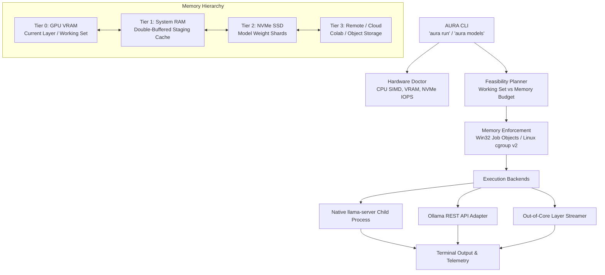

# AURA Engineering & Architecture Guide

---

## Component Implementation Status

- **`crates/aura-core`**: Core data structures, `MetricProvenance`, `BackendType`, and error types. (**IMPLEMENTED**)
- **`crates/aura-hardware`**: Multi-platform hardware telemetry probing via CPUID, sysinfo, and WMI/nvidia-smi. (**IMPLEMENTED**)
- **`crates/aura-memory`**: Hard process budget limits via Win32 Job Objects and Linux cgroup v2. (**IMPLEMENTED**)
- **`crates/aura-model`**: Ollama blob resolution and GGUF header parsing. (**IMPLEMENTED**)
- **`crates/aura-backends`**: Process-managed `llama-server` adapter and Ollama baseline client. (**IMPLEMENTED**)
- **`crates/aura-planner`**: Budget feasibility calculation, context auto-tuning, and `ExpertCache`. (**IMPLEMENTED**)
- **`crates/aura-cli`**: Complete command suite (`hardware-doctor`, `storage-doctor`, `models`, `frontier`, `run`, `benchmark`). (**IMPLEMENTED**)
