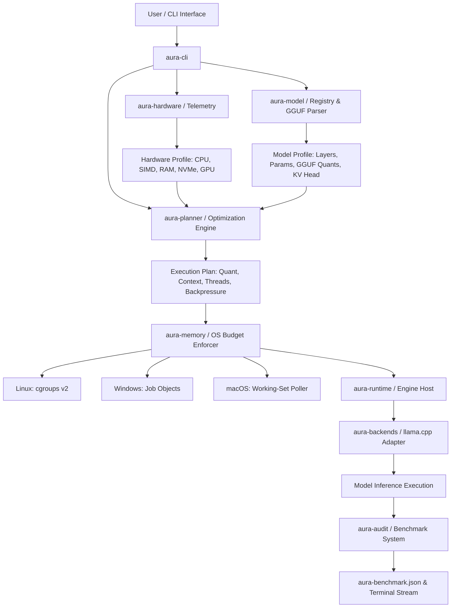

# AURA Architecture Specification

**Project Name:** AURA (Adaptive Ultra-Low-Memory Runtime for AI)  
**Version:** 0.1.0 Architecture Blueprint  
**Status:** Approved Engineering Baseline  

---

## 1. System Vision & Positioning

AURA is **NOT** a new low-level tensor kernel library or a naive wrapper around model download scripts. AURA is a **hardware-aware, memory-budgeted local inference optimizer and orchestration engine** that sits above proven execution backends (principally `llama.cpp` / `GGML`).

### What AURA Is:
1. **Adaptive Execution Planner:** Given a target model, hardware telemetry, and an explicit RAM/VRAM memory budget, AURA computes the mathematically optimal combination of quantization level, context window size, thread allocation, KV-cache precision, and tensor placement/offloading strategy.
2. **Honest Resource Accounting Layer:** Enforces process-level memory limits using host OS kernel mechanisms (`cgroups v2` on Linux, Job Objects on Windows, RSS self-throttling on macOS) and publishes machine-readable telemetry indicating exact resource consumption and enforcement tier.
3. **Reproducible Optimization Flywheel:** Maintains a local and opt-in shared telemetry database (`aura-benchmark.json`) mapping `(hardware_signature, model_hash, budget) -> (execution_plan, throughput, latency, quality)`.

### What AURA Is NOT:
1. **Not a 70B-on-2GB Magic System:** AURA respects hardware physics. Dense model streaming across PCI-e / SATA / NVMe storage is throughput-bound by physical read bandwidth ($B_{storage}$). AURA will reject impossible execution requests before downloading weights.
2. **Not a Fork of llama.cpp:** AURA binds to llama.cpp as a dynamic or sub-process backend adapter, leveraging upstream AVX2/AVX-512/NEON SIMD kernels, mmap lazy-loading, and GGUF quantization.
3. **Not a Multi-Tenant Datacenter Server:** AURA optimizes for single-user, batch-size-1 local inference on consumer hardware (4 GB – 32 GB RAM, CPU-only or modest integrated/discrete GPUs).

---

## 2. Decision Matrix: Architectural Stance

| Criteria | 1. Wrapper around llama.cpp | 2. Fork of llama.cpp | 3. Runtime above multiple backends | 4. New inference runtime | 5. Hybrid Architecture |
|---|---|---|---|---|---|
| **Performance** | High (uses C++) | High | High | Low (years of kernel optimization needed) | High |
| **Development Effort** | Low | High | Medium | Extreme | Medium |
| **Model Compatibility** | Excellent (GGUF ecosystem) | High | Excellent | Extremely Low | Excellent |
| **Memory Control** | Medium (via CLI/FFI) | High | High (via OS wrappers & adapters) | Complete | High |
| **Storage & Prefetch** | Low | Medium | High (via custom prefetch queue) | Complete | High |
| **Long-Term Maintainability** | High | Low (upstream merge debt) | High | Low | High |
| **Innovation Scope** | Low | Medium | High (planning + database + OS bounds) | High | High |
| **Selected Option** | ❌ Reject | ❌ Reject | ❌ Reject | ❌ Reject | **✅ SELECTED: Option 5 (Hybrid Runtime Architecture)** |

### Architectural Decision:
AURA adopts a **Hybrid Architecture (Option 5)**:
- **Control Plane & Planner:** Built in **Rust** for memory safety, deterministic concurrency, robust OS API bindings, fast JSON parsing, and CLI ergonomics.
- **Execution Backend:** Native FFI/process adapter to **C/C++ backends** (`llama.cpp` for GGUF dense and CPU-MoE models).
- **Storage & Prefetch Engine:** A native Rust crate (`aura-storage`) managing asynchronous mmap advice (`madvise`/`prefetch`), file page caching, and I/O bandwidth estimation.

---

## 3. High-Level System Topology

---

## 4. Subsystem Components & Responsibilities

### 4.1 `aura-core`
- Defines domain types: `HardwareProfile`, `ModelManifest`, `ExecutionPlan`, `BenchmarkRecord`, `MemoryBudget`.
- Common error handling (`AuraError`) and logging traits.

### 4.2 `aura-hardware`
- Probes CPU model, physical/logical core topology, SIMD extensions (`AVX2`, `AVX512F`, `NEON`, `AMX`).
- Probes physical RAM, available RAM, swap space, OS page-size.
- Evaluates storage bandwidth via non-destructive 64MB sequential and 4K random read benchmarks.
- Detects iGPU/dGPU presence, VRAM capacity, and platform runtime support (Metal/CUDA/Vulkan).

### 4.3 `aura-model`
- Inspects GGUF headers without full model loading.
- Extracts parameter counts (total vs active), architecture (dense vs MoE), block counts, head counts, quantization types (`Q4_K_M`, `Q8_0`, `IQ3_XS`), and tokenizers.
- Validates model cryptographic hashes (SHA-256) and license metadata.

### 4.4 `aura-planner`
- Analytical feasibility engine:
  $$Memory_{required} = WeightBytes(Quant) + KVCacheBytes(Ctx, CtxQuant) + OverheadBuffer$$
- Checks if $Memory_{required} \le Memory_{budget}$.
- Estimates token-generation throughput floor based on storage and RAM bandwidth.
- Outputs an immutable `ExecutionPlan` containing recommended binary flags, thread counts, quantization variant, context length, and memory limits.

### 4.5 `aura-memory`
- Implements platform-specific hard memory ceiling wrappers around the execution engine process:
  - **Linux:** Systemd transient scope or raw cgroups v2 (`memory.max`, `memory.high`, `memory.swap.max=0`, pressure stall information monitoring via `memory.pressure`).
  - **Windows:** Job Objects API (`SetInformationJobObject` with `JobObjectExtendedLimitInformation.ProcessMemoryLimit`).
  - **macOS:** Working-set RSS monitoring loop with proactive fallback signaling (best-effort).

### 4.6 `aura-backends`
- FFI / RPC Abstraction layer for execution backends.
- `LlamaCppBackend`: Launches and manages native `llama.cpp` process or FFI binding, translating `ExecutionPlan` to CLI/API flags (`--ctx-size`, `--threads`, `--n-gpu-layers`, `--kv-cache-type`).

### 4.7 `aura-benchmark` & `aura-audit`
- Collects cold-start, warm-cache, and steady-state decode performance metrics.
- Formats metrics into the standard schema `aura-benchmark.json`.
- Implements `aura benchmark reproduce <JSON>` to verify historical runs.

---

## 5. Technology Stack

- **CLI & Control Plane:** Rust 1.80+ (Edition 2021)
- **Crate Dependencies:** `clap` (CLI parser), `serde`/`serde_json` (serialization), `sysinfo`/`raw-cpuid` (hardware probing), `cgroups-rs` (Linux memory), `windows-sys` (Windows API), `libc` (POSIX bindings), `tracing` (observability).
- **Execution Engine:** `llama.cpp` (C/C++20, CMake/Make build, MIT license).
- **Research Stack:** Python 3.11+, Jupyter Notebooks, PyTorch, Hugging Face `transformers` (isolated strictly in `/python` and `/notebooks`, never required for production CLI distribution).
