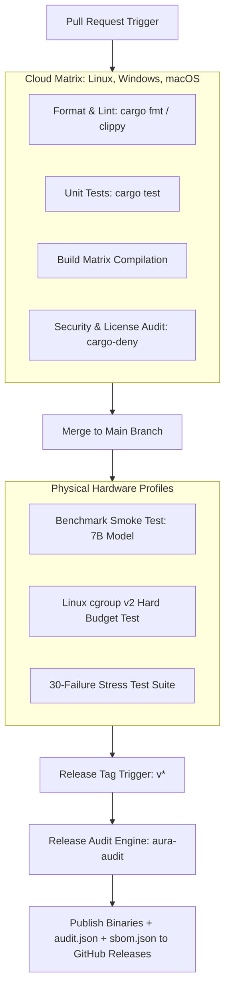

# AURA CI/CD Pipeline Architecture

**Project:** AURA (Adaptive Ultra-Low-Memory Runtime for AI)  
**Document Type:** Continuous Integration & Delivery Architecture  
**Status:** Approved  

---

## 1. Pipeline Topology & Runner Architecture

AURA requires a **hybrid CI/CD architecture**. Standard deterministic tasks (linting, format, unit testing, cross-compilation) execute on cloud-hosted GitHub runners. Hardware-sensitive tasks (memory budget enforcement under cgroups, storage I/O benchmarks, thermal throttling tests) execute on dedicated **self-hosted reference hardware runners**.



---

## 2. CI/CD Stage Breakdown

### Stage 1: Pull Request Gate (GitHub-Hosted Runners)
- **Platforms:** `ubuntu-latest`, `windows-latest`, `macos-latest`
- **Steps:**
  1. `cargo fmt --all -- --check`
  2. `cargo clippy --workspace --all-targets -- -D warnings`
  3. `cargo test --workspace`
  4. `cargo audit` & `cargo deny check`
  5. Cross-compile build validation:
     - `x86_64-unknown-linux-gnu`
     - `x86_64-pc-windows-msvc`
     - `aarch64-apple-darwin`

### Stage 2: Main Branch Integration Gate (Self-Hosted Reference Runner)
- **Platform:** Dedicated Linux reference hardware (e.g. 8GB RAM, NVMe SSD)
- **Steps:**
  1. Execute synthetic GGUF model load & mmap verification.
  2. Execute `cgroup v2` memory ceiling test (`MemoryMax=4G`).
  3. Run fast benchmark smoke test (10 tokens decode).
  4. Compare latency against main branch historical baseline.

### Stage 3: Release Candidate Gate (Self-Hosted Reference Hardware Matrix)
- **Platforms:** Physical Reference Hardware Profiles (8GB Laptop, 16GB Desktop, Apple Silicon Mac).
- **Steps:**
  1. Execute full benchmark suite across all supported MVP models.
  2. Collect cold start, warm cache, and steady-state telemetry.
  3. Execute 30-scenario failure mode stress suite.
  4. Generate CycloneDX SBOM (`sbom.json`).
  5. Assemble `audit.json` and `AUDIT.md`.
  6. Enforce Performance Regression Gate:
     - IF peak RSS increases > 2% vs prior version → **FAIL RELEASE**
     - IF decode throughput drops > 3% vs prior version → **FAIL RELEASE**
  7. Publish release assets to GitHub Releases automatically upon 100% pass.

---

## 3. GitHub Actions Workflow Configuration (`.github/workflows/ci.yml`)

```yaml
name: AURA CI/CD Pipeline

on:
  push:
    branches: [ main ]
    tags: [ 'v*' ]
  pull_request:
    branches: [ main ]

jobs:
  code-quality:
    name: Code Quality & Unit Tests
    runs-on: ${{ matrix.os }}
    strategy:
      matrix:
        os: [ubuntu-latest, windows-latest, macos-latest]
    steps:
      - uses: actions/checkout@v4
      - uses: dtolnay/rust-toolchain@stable
        with:
          components: clippy, rustfmt
      - name: Format Check
        run: cargo fmt --all -- --check
      - name: Linting Check
        run: cargo clippy --workspace --all-targets -- -D warnings
      - name: Run Unit Tests
        run: cargo test --workspace

  security-audit:
    name: Security & License Scan
    runs-on: ubuntu-latest
    steps:
      - uses: actions/checkout@v4
      - uses: EmbarkStudios/cargo-deny-action@v1

  benchmark-audit:
    name: Self-Hosted Benchmark & Audit Gate
    needs: [code-quality, security-audit]
    if: startsWith(github.ref, 'refs/tags/v')
    runs-on: [self-hosted, linux, x86_64, reference-laptop]
    steps:
      - uses: actions/checkout@v4
      - name: Build Release Binary
        run: cargo build --release --workspace
      - name: Execute Budget & cgroup Enforcement Test
        run: ./target/release/aura-test-cgroup --budget 4G
      - name: Run Official Benchmark Suite
        run: ./target/release/aura benchmark --model Qwen2.5-7B-Instruct --memory 4G --out aura-benchmark.json
      - name: Run Release Audit Engine
        run: ./target/release/aura-audit --out audit.json
      - name: Upload Release Assets
        uses: softprops/action-gh-release@v1
        with:
          files: |
            target/release/aura
            aura-benchmark.json
            audit.json
```
