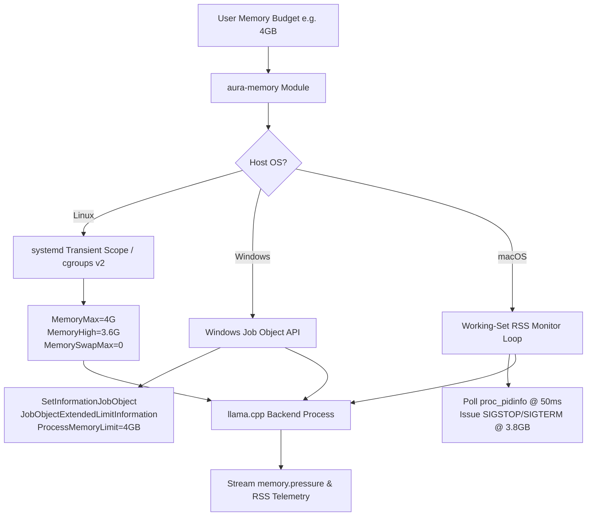

# AURA Memory & Storage Architecture Specification

**Project:** AURA (Adaptive Ultra-Low-Memory Runtime for AI)  
**Document Type:** Deep Technical Memory Architecture  
**Status:** Approved  

---

## 1. Physical Memory Hierarchy & Storage Physics

In ultra-low-memory local inference, RAM acts as a **l2 cache** between persistent disk storage (NVMe / SATA SSD) and CPU/GPU compute registers.

```
+-------------------------------------------------------------------+
|                         CPU Registers / Cache                     |  Fastest (TB/s)
+-------------------------------------------------------------------+
                                  ▲
                                  │ Memory Bus (20 - 100 GB/s)
+-------------------------------------------------------------------+
|                         Physical Host RAM                         |  Constrained Tier (4-16 GB)
+-------------------------------------------------------------------+
                                  ▲
                                  │ PCIe / SATA Interface (0.5 - 7 GB/s)
+-------------------------------------------------------------------+
|                       NVMe / SATA SSD Storage                     |  Persistent Tier (100+ GB)
+-------------------------------------------------------------------+
```

### Storage Bandwidth Physics Lower Bound Equation:
To generate 1 token on a dense model, every active model parameter must cross the bandwidth bus:

$$t_{token\_min} = \frac{\text{ActiveWeightBytes}}{\text{AchievableStorageBandwidth}}$$

- **Example 1 (70B FP16 - 140 GB on Gen4 NVMe @ 7 GB/s):**
  $$t_{token\_min} = \frac{140 \text{ GB}}{7 \text{ GB/s}} = 20 \text{ seconds/token} \quad (0.05 \text{ tok/s})$$
- **Example 2 (7B Q4_K_M - 4.3 GB on Gen3 NVMe @ 2.4 GB/s):**
  $$t_{token\_min} = \frac{4.3 \text{ GB}}{2.4 \text{ GB/s}} = 1.79 \text{ seconds/token (Cold)}} \quad \rightarrow \quad \text{Warm RAM Cache:} \ge 15 \text{ tok/s}$$

**Conclusion:** Cold streaming across storage is physics-constrained by disk bandwidth. AURA's primary objective is maximizing OS page-cache retention for active weight tensors within the user's explicit RAM budget.

---

## 2. Hard OS Memory Enforcement Architecture

AURA explicitly rejects software-only self-reporting. Memory bounds are enforced using native operating system kernel primitives.



### 2.1 Linux (`cgroups v2` & `systemd`)
- **Enforcement Type:** Hard Kernel Enforcement (`cgroup_v2_hard`).
- **Mechanism:** Launches backend inside a transient systemd scope via `systemd-run --scope -p MemoryMax=4G -p MemoryHigh=3.6G -p MemorySwapMax=0`.
- **Behavior:**
  - `MemoryHigh` (3.6 GB): Triggers kernel reclaim and allocations backpressure.
  - `MemoryMax` (4.0 GB): Hard ceiling. If un-reclaimable, invokes OOM killer scoped exclusively to the transient cgroup.
  - `memory.pressure` (PSI): Streamed by `aura-memory` to monitor pressure stalls.

### 2.2 Windows (Job Objects)
- **Enforcement Type:** Hard OS Limit (`windows_job_object`).
- **Mechanism:** Creates Job Object with `JOBOBJECT_EXTENDED_LIMIT_INFORMATION` setting `ProcessMemoryLimit = 4 GB`.
- **Behavior:** Windows kernel terminates process with status `STATUS_COMMITMENT_LIMIT` upon violation. `aura-memory` polls `GetProcessMemoryInfo` to issue early soft warnings before termination.

### 2.3 macOS (Working-Set RSS Polling)
- **Enforcement Type:** Best-Effort Soft Limit (`macos_best_effort`).
- **Mechanism:** macOS Jetsam is system-wide and lacks an unprivileged per-process API. `aura-memory` polls process RSS via `proc_pidinfo` every 50ms.
- **Behavior:** Proactively signals soft-throttle or SIGTERM when process RSS exceeds 95% of target budget. Clearly labeled as `macos_best_effort` in all benchmark outputs.

---

## 3. Memory Accounting Contract

For every run, AURA records and outputs the complete memory breakdown:
- **Requested Budget:** User specified target (e.g. `4,294,967,296 bytes`).
- **Enforcement Mechanism:** Machine-readable string (`cgroup_v2_hard`, `windows_job_object`, `macos_best_effort`).
- **Peak RSS:** Maximum physical RAM occupied.
- **Peak Virtual Mapped:** Total `mmap` address space created.
- **Major Page Faults:** Count of disk-bound page reads.
- **Page Cache Contribution:** Volume of model weights served directly from OS page cache.
